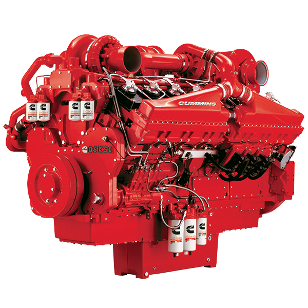

# Corbenz Engine - Landing Page Industrial Premium

Este proyecto es una página de aterrizaje (landing page) de alto impacto diseñada para **Corbenz Engine**, una empresa especializada en servicios de mantenimiento de motores marinos, industriales, portuarios, minería y construcción.



## 🚀 Características Principales

- **Diseño Industrial Premium**: Paleta de colores "Industrial Harmony" basada en azules profundos y acentos cian técnicos.
- **Efectos Parallax Avanzados**: Interactividad dinámica con el cursor en las imágenes principales del motor y equipo.
- **Animaciones de Revelado**: Secciones que aparecen suavemente al hacer scroll utilizando `IntersectionObserver`.
- **Responsive Design**: Completamente adaptable a dispositivos móviles con menú hamburguesa dedicado.
- **Botón de WhatsApp Flotante**: Acceso directo para comunicación inmediata con el cliente.
- **Optimización UI/UX**: Header pegajoso (sticky), navegación suave y micro-interacciones en botones.

## 🛠️ Tecnologías Utilizadas

- **HTML5**: Estructura semántica para SEO.
- **CSS3**: Variables (Custom Properties), Flexbox, Grid y animaciones complejas.
- **Vanilla JavaScript**: Lógica de interactividad sin dependencias externas.
- **Boxicons**: Iconografía técnica y moderna.
- **Google Fonts**: Tipografía profesional.

## 📁 Estructura del Proyecto

```text
web_mecanico-main/
├── fotos/           # Activos visuales (motores, logos, iconos)
├── index.html       # Estructura principal de la web
├── styles.css       # Diseño, animaciones y responsive
└── script.js       # Interactividad y lógica de scroll
```

## 💻 Cómo Ejecutar el Proyecto

1. Clona o descarga el repositorio.
2. Abre el archivo `index.html` en cualquier navegador moderno.
3. Se recomienda usar una extensión como "Live Server" en VS Code para una mejor experiencia de visualización.

---
© 2025 Corbenz Engine. Todos los derechos reservados.
